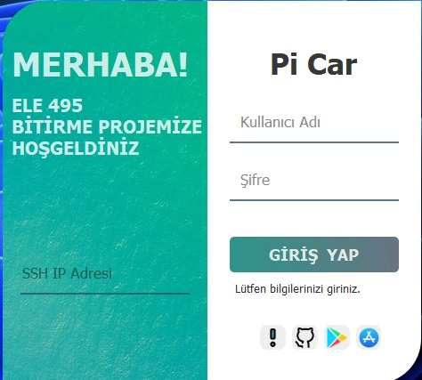
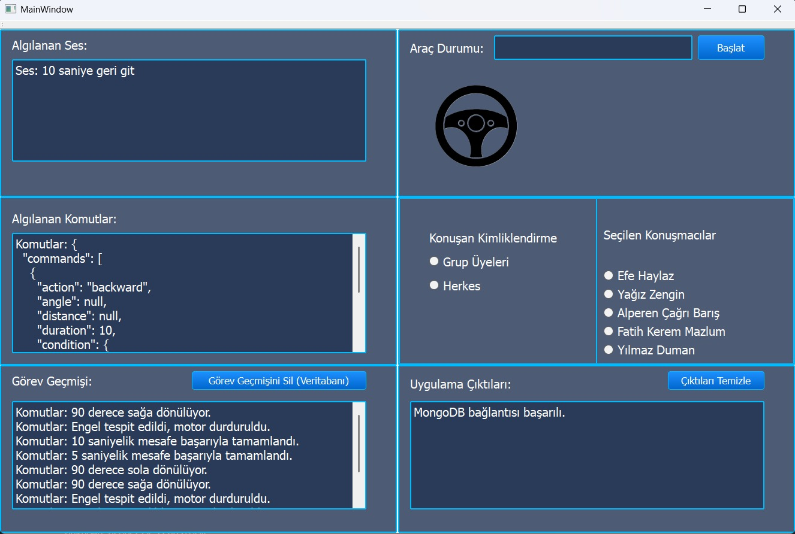
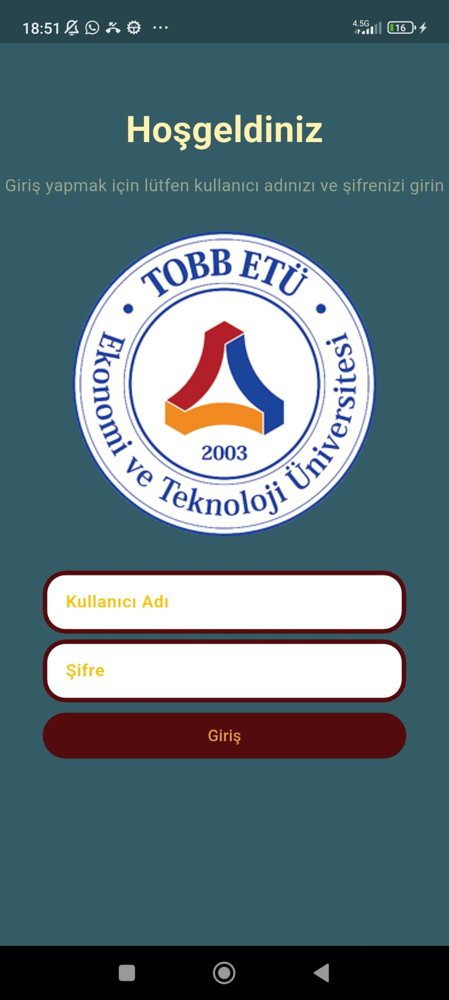
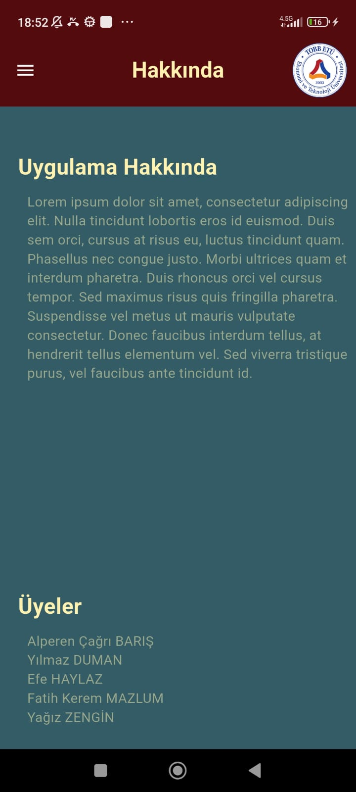
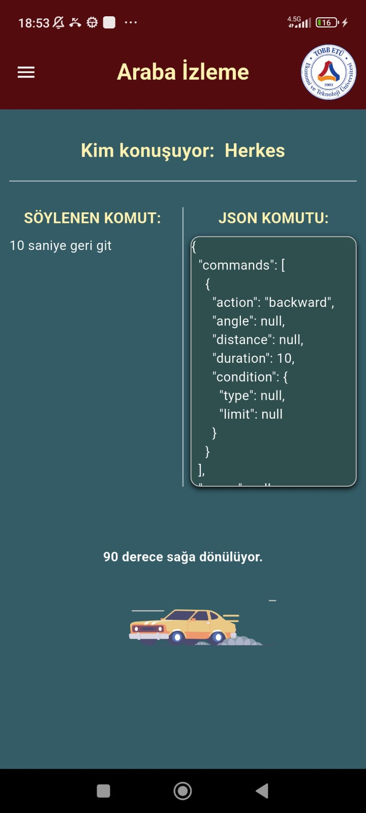
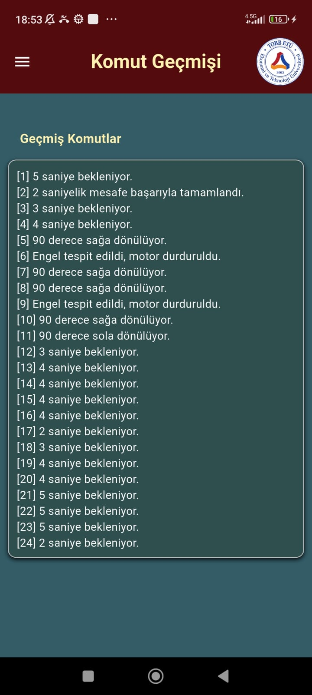

# TOBB ETÜ ELE495 - Capstone Project

# Table of Contents
- [Introduction](#introduction)
- [Hardware](#hardware)
- [Operating System and Packages](#operating-system-and-packages)
- [Applications](#applications)
- [Services](#services)
- [Installation](#installation)
- [Usage](#usage)
- [Screenshots](#screenshots)
- [Acknowledgements](#acknowledgements)

## Introduction
This Project focuses on developing autonomous vehicle prototype capable of running with Turkish voice commands. Raspberry pi 4 is used for operation. The vehicle acquires voice commands through microphone, these commands are converted to text commands through Google cloud. Text commands are sent to Open AI API for jason formatting for our system. Movement commands are executed using DC motors, motor controllers and gyroscope.


## Hardware
- Raspberry Pi 4
- MPU6050 Gyroscope Accelerometer
- SG90 RC Mini (9gr) Servo Motor
- L298N Motor Driver
- DC Motor
- Power Supply

## Operating System and Packages
The computer application is designed for the Windows operating system.

The mobile application is designed for phones with the Android operating system.

The requirements are explained in the "Installation" section.

## Applications
A computer application and a mobile application have been designed. The vehicle can be started via the computer application.

## Services
Both the application and the code within the Raspberry Pi leverage a number of service providers.

1- Eleven Labs
2- OpenAI
3- Google Cloud
4- Mongo DB
5- Porcupine

## Installation
Describe the steps required to install and set up the project. Include any prerequisites, dependencies, and commands needed to get the project running.

The "Arayuz_Uygulama" folder contains build and dist directories. You can download a ready-to-run application for your computer by downloading the file located here. No additional libraries need to be downloaded for this version.

Similarly, the uncompiled application can be run from the "Arayuz_BitirmeProje" folder. To run this code, you'll need to have the "vlc", "PyQT5", "paramiko", and "pymongo" libraries installed.


```bash
# Example download command
git clone https://github.com/ELE495-2425Summer/capstoneproject-eski-camoluk.git
cd Arayuz_BitirmePython
```


## Usage
Provide instructions and examples on how to use the project. Include code snippets or screenshots where applicable.

To start the vehicle, you must first press the "Başlat" button on the interface. Once the interface notifies you, you should say, "Hey Pi Car." When this phrase is detected, the vehicle will begin listening for your commands. At this point, you should state the commands you want the vehicle to perform.

For example, if you give a command like "5 metre ileri git" this command is converted into a JSON file with appropriate values assigned to the necessary variables. The program then translates the data received from the JSON into computer commands, which are converted into physical movements, and the vehicle begins to move.

If an unexecutable command is given, such as "Pizza siparişi ver" the vehicle will respond by saying it cannot fulfill the requested command and will await a new command from the user.


## Screenshots
Include screenshots of the project in action to give a visual representation of its functionality. You can also add videos of running project to YouTube and give a reference to it here.

Screenshots of the computer application are attached below.




A mobile application has also been designed. Screenshots of the mobile application are included below.







## Acknowledgements
Give credit to those who have contributed to the project or provided inspiration. Include links to any resources or tools used in the project.

Prepared by:
Yağız Zengin
Efe Haylaz
Yılmaz Duman
Alperen Çağrı Barış
Fatih Kerem Mazlum

[Contributor 1](https://github.com/user1)
[Resource or Tool](https://www.nvidia.com)
